# **Noto**

> **Noto** berasal dari bahasa Jawa yang berarti **“Menata”**, sesuai dengan tujuan aplikasi ini yakni membantu UMKM untuk **menata, mengelola, dan memantau keuangan & operasional usaha** dengan mudah, modern, dan terstruktur.

---

## 📸 **Screenshots**

### 🌞 Light Mode
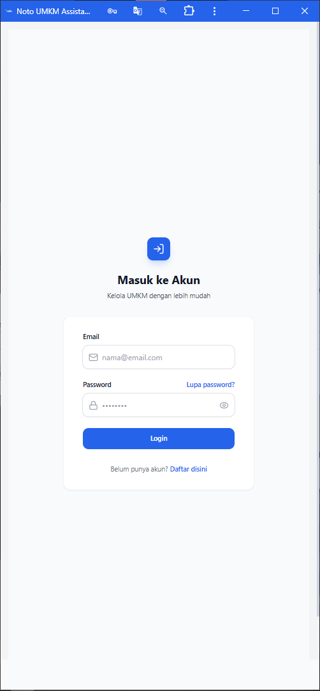
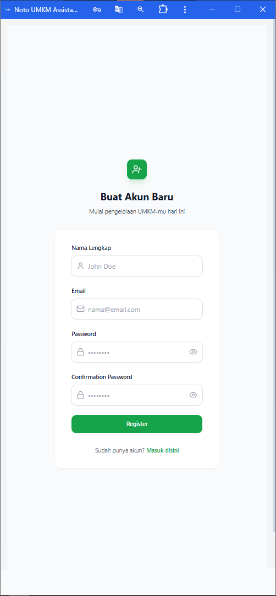
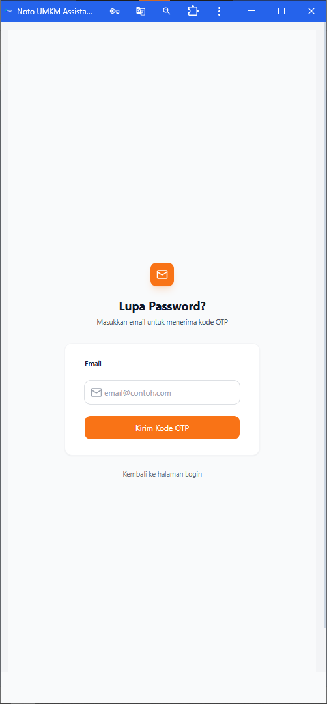
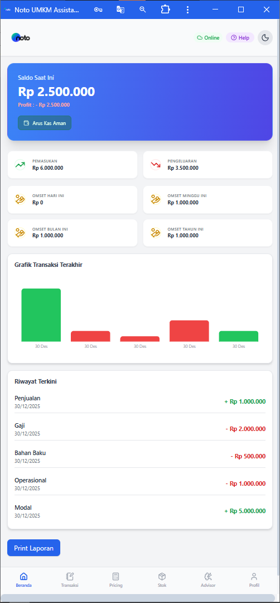
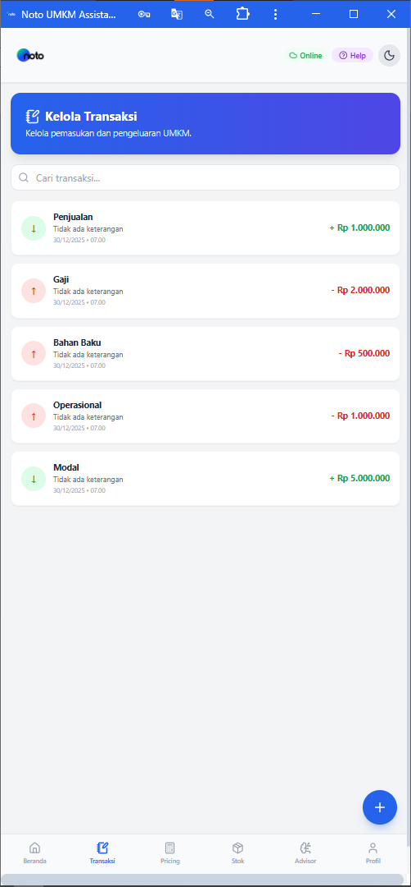
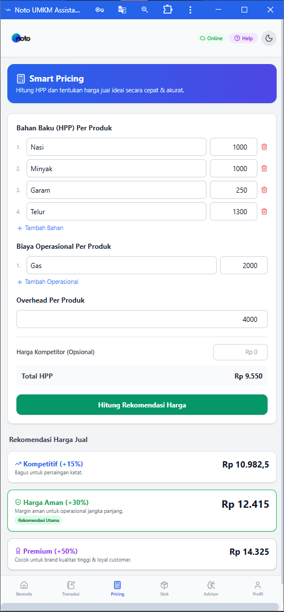
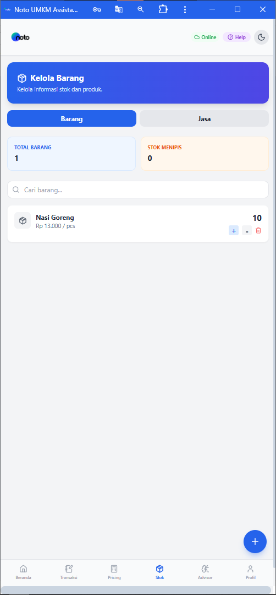
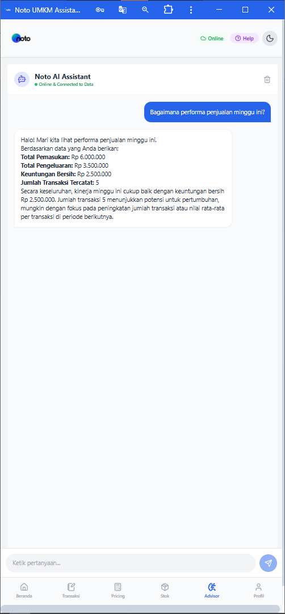
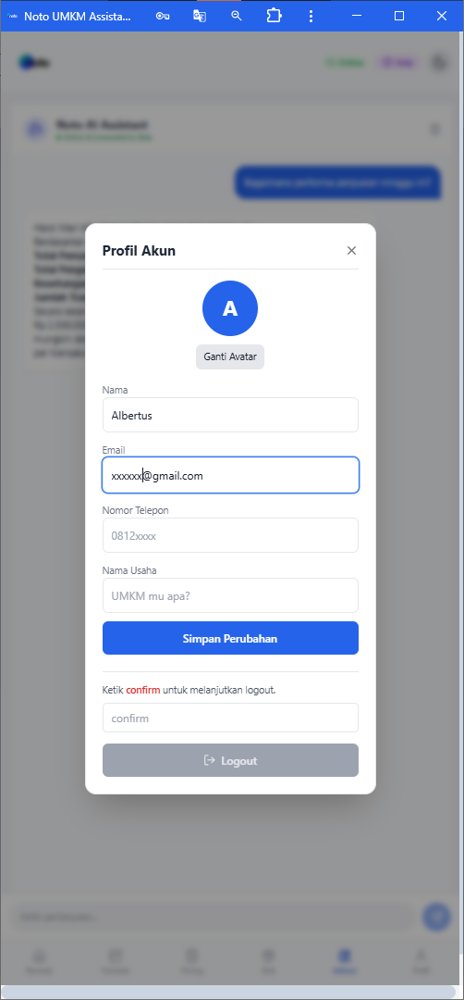

### 🌙 Dark Mode
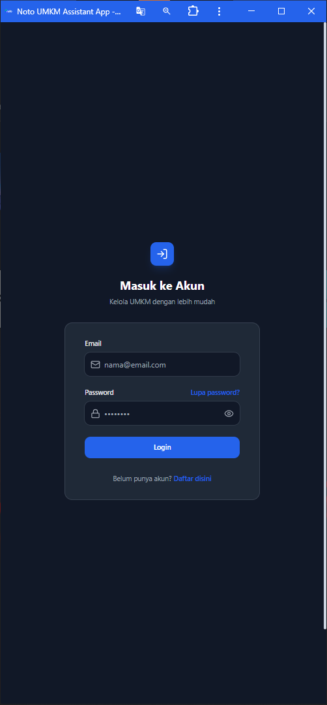
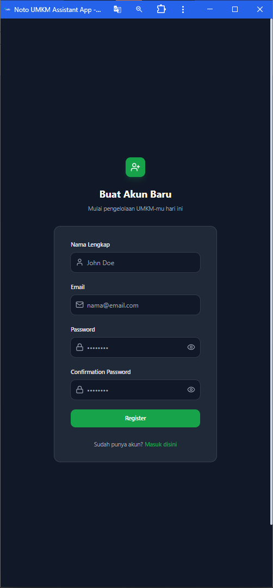
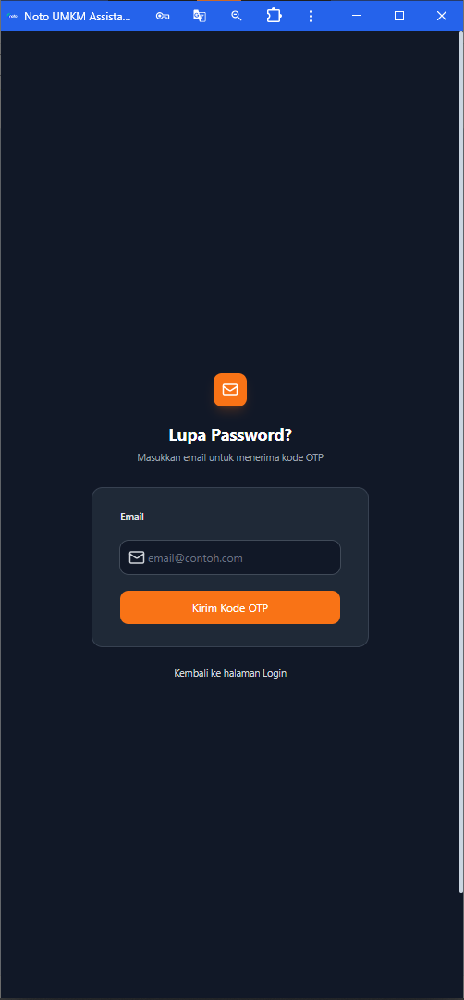
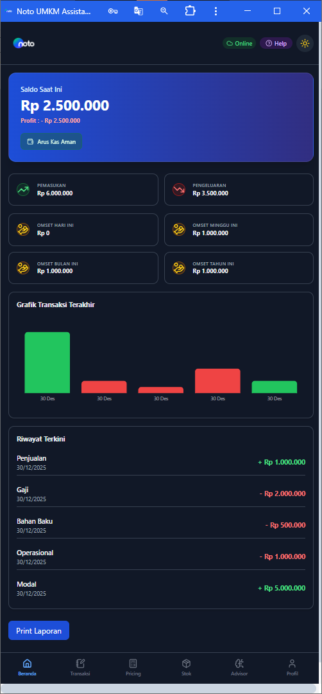
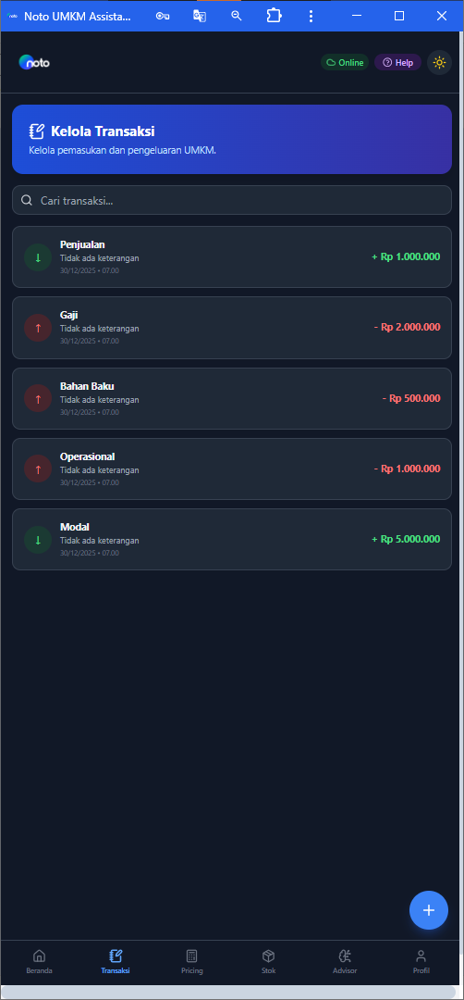
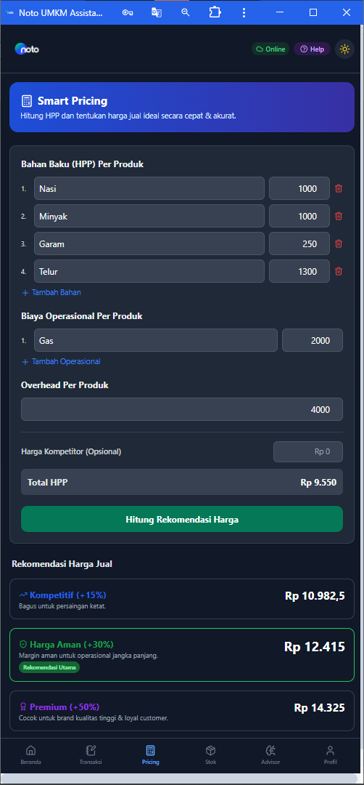
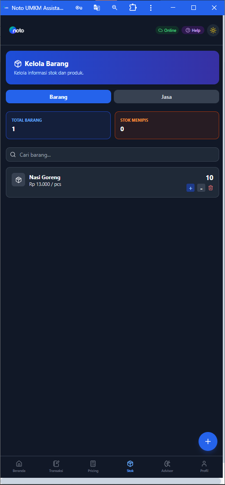
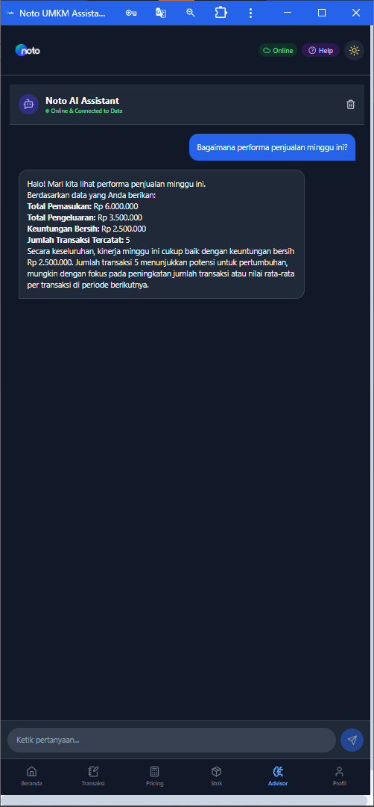
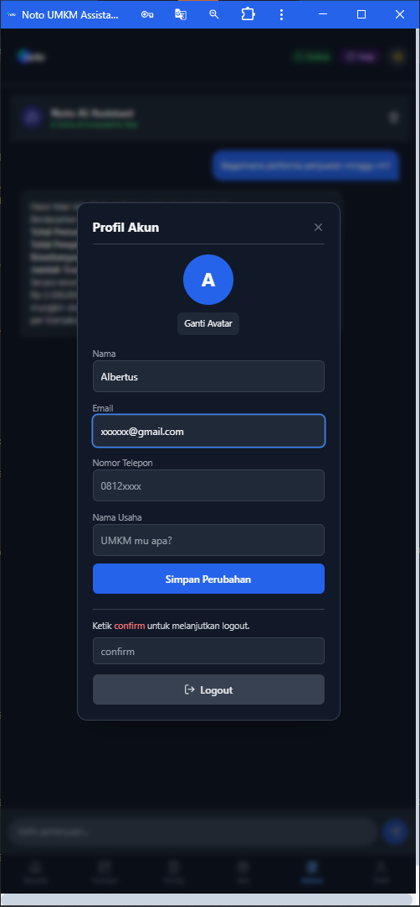

---

## 📌 **Teknologi yang Digunakan**

| Layer                  | Teknologi                                                |
| ---------------------- | -------------------------------------------------------- |
| Backend                | **Laravel**                                              |
| Frontend               | **React + Tailwind CSS**                                 |
| Database               | **IndexedDB (Offline Storage)** + **MySQL (Primary DB)** |
| Authentication         | **Bearer Token – Laravel Sanctum**                       |
| Realtime Communication | **Laravel Reverb**                                       |
| Queue                  | **Laravel Queue Worker**                                 |
| AI Service             | **Gemini 2.5 Integration**                               |

---

## ✨ **Fitur Utama**

### 🔐 Authentication & User Management

* Register akun
* Login menggunakan Token Bearer (Sanctum)
* Session management
* Update profile
* Logout

### 📊 Manajemen Keuangan UMKM

* Pencatatan pemasukan (Income)
* Pencatatan pengeluaran (Expense)
* Kategori transaksi
* Ringkasan dashboard
* Perhitungan profit otomatis (+/-)

### 🏪 Manajemen Stok UMKM

* Kelola stok barang
* Tambah / edit / hapus item
* Monitoring perubahan stok
* Validasi stok agar tidak minus

### ☁️ Hybrid Database

* **MySQL** untuk data utama
* **IndexedDB** untuk mode offline
* Sinkronisasi otomatis ketika online kembali

### ⚡ Realtime & Modern UX

* Realtime update menggunakan Laravel Reverb
* UI nyaman dengan Tailwind CSS
* Popup modal misalnya profil dll

### 🤖 AI Feature (Gemini 2.5)

* Konsultasi bisnis
* Rekomendasi strategi UMKM
* Insight dari data keuangan

---

## 🧩 **Architecture Overview**

* Frontend (React) berkomunikasi ke Backend via REST API
* Auth protected menggunakan Sanctum Token
* IndexedDB menyimpan data lokal
* Sinkronisasi dilakukan saat online
* Reverb menangani realtime event

---

# ⚙️ Instalasi & Setup

---

## 🛠️ **Backend (Laravel) Setup**

Masuk ke folder backend:

```bash
cd backend
```

### 1️⃣ Install Dependencies

```bash
composer install
```

### 2️⃣ Setting Environment

Duplikat `.env.example` menjadi `.env`

```bash
cp .env.example .env
```

Atur:

* Database MySQL
* Sanctum
* Reverb
* Queue
* Base URL API

### 3️⃣ Generate Key

```bash
php artisan key:generate
```

### 4️⃣ Migrasi Database

```bash
php artisan migrate
```

### 5️⃣ Jalankan Server

```bash
php artisan serve
```

### 6️⃣ Jalankan Reverb

```bash
php artisan reverb:start
```

### 7️⃣ Jalankan Queue Worker

```bash
php artisan queue:work
```

Backend siap digunakan 🎉

---

## 🎨 **Frontend (React) Setup**

Masuk ke folder frontend:

```bash
cd frontend
```

### 1️⃣ Install Dependencies

```bash
npm install
```

### 2️⃣ Setting Environment

Buat file:

```
.env
```

Isi minimal:

```env
VITE_API_URL=http://localhost:8000
VITE_APP_NAME=Noto
```

Kalau ada Reverb / Websocket config tambahkan juga.

### 3️⃣ Jalankan Project

```bash
npm run dev
```

Frontend siap digunakan 🚀

---

# 🧭 **Alur Penggunaan Aplikasi**

Berikut flow penggunaan dari awal sampai logout:

### 1️⃣ Register

* Buka aplikasi
* Isi form pendaftaran
* Submit
* Akun berhasil dibuat

### 2️⃣ Login

* Masukkan email & password
* Server mengembalikan **Bearer Token**
* Token disimpan untuk session

### 3️⃣ Mulai Mengelola UMKM

Pengguna bisa:

* Input pemasukan
* Input pengeluaran
* Kelola stok barang
* Pantau dashboard
* Dapat insight keuangan

### 4️⃣ Realtime & Offline

* Jika offline → data disimpan IndexedDB
* Jika online → tersinkron otomatis

### 5️⃣ Update Profil (Opsional)

* Buka menu profile popup
* Update nama / email
* Simpan perubahan

### 6️⃣ Logout

* Token dihapus
* Session selesai
* User keluar dengan aman

---

## 📦 **Build Production**

Frontend:

```bash
npm run build
```

Backend:
Pastikan:

* Queue jalan
* Reverb jalan
* Storage & permission OK
